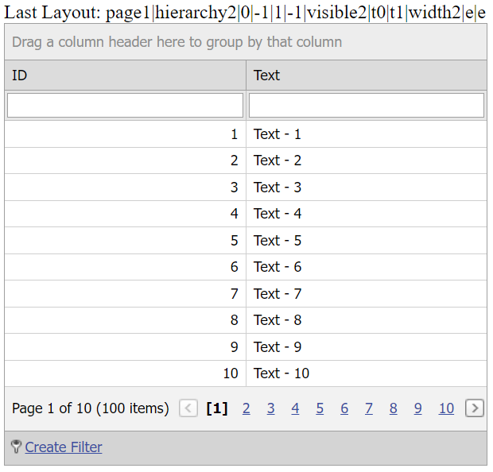

<!-- default badges list -->

[](https://supportcenter.devexpress.com/ticket/details/T205817)
[](https://docs.devexpress.com/GeneralInformation/403183)
<!-- default badges end -->
# Grid View for ASP.NET MVC - How to save and restore client layout within a session

This example demonstrates how to handle the grid's [ClientLayout](https://docs.devexpress.com/AspNetMvc/DevExpress.Web.Mvc.GridSettingsBase.ClientLayout) event to save and restore the grid's client layout. The modified layouts are stored in a session.



## Overview

Handle the grid's server-side [ClientLayout](https://docs.devexpress.com/AspNet/DevExpress.Web.ASPxGridBase.ClientLayout) event and do the following in the handler:
* Set the [LayoutMode](https://docs.devexpress.com/AspNet/DevExpress.Web.ASPxClientLayoutArgs.LayoutMode) argument property to `Saving` to save the current client layout to a session.
* Set the [LayoutMode](https://docs.devexpress.com/AspNet/DevExpress.Web.ASPxClientLayoutArgs.LayoutMode) argument property to `Loading` to restore the last client layout from the session.

```cshtml
@Html.DevExpress().GridView(settings => {
    <!-- ... -->
    settings.ClientLayout = (s, e) => {
        switch (e.LayoutMode) {
            case ClientLayoutMode.Loading:
                if (Session["Layout"] != null) {
                    e.LayoutData = Session["Layout"].ToString();
                }
                break;
            case ClientLayoutMode.Saving:
                Session["Layout"] = e.LayoutData;
                break;
        }
    };
}).Bind(Model).GetHtml()
```

Note that you can use the grid's [SettingsCookies](https://docs.devexpress.com/AspNetMvc/DevExpress.Web.Mvc.GridViewSettings.SettingsCookies) property to emulate the same behavior. In this case, the last client layout is stored on the client.

```cshtml
@Html.DevExpress().GridView(settings => {
    <!-- ... -->
    settings.SettingsCookies.Enabled = true;
}).Bind(Model).GetHtml()
```

## Files to Review

* [HomeController.cs](./CS/DXWebApplication1/Controllers/HomeController.cs) (VB: [HomeController.vb](./VB/DXWebApplication1/Controllers/HomeController.vb))
* [GridViewPartial.cshtml](./CS/DXWebApplication1/Views/Home/GridViewPartial.cshtml)
* [Index.cshtml](./CS/DXWebApplication1/Views/Home/Index.cshtml)

## Documentation

* [Save and Restore Client Layout](https://docs.devexpress.com/AspNet/4342/components/grid-view/concepts/save-and-restore-client-layout)

## More Examples

* [Grid View for ASP.NET Web Forms - How to use a list box editor to save and restore client layout](https://github.com/DevExpress-Examples/asp-net-web-forms-grid-use-listbox-to-save-and-restore-client-layout)
* [Grid View for ASP.NET MVC - How to use a list box editor to save and restore client layout](https://github.com/DevExpress-Examples/gridview-how-to-track-clientlayout-with-a-separate-listbox-t146962)
